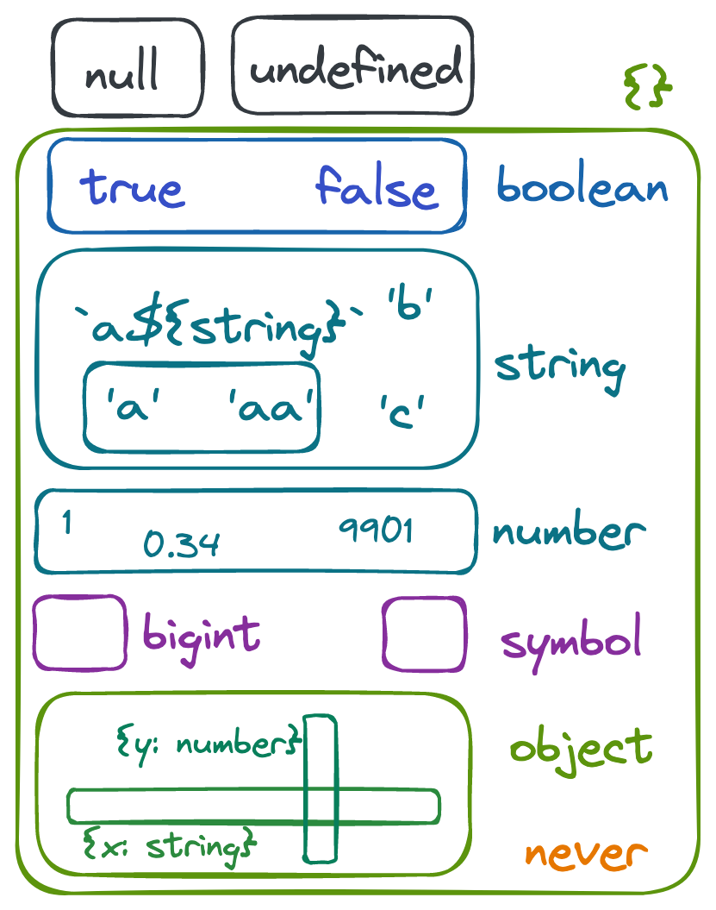

# (Somewhat) Advanced TypeScript Induction - 06042023

## Topics

1. Enable Strict null check (and avoid sanity checks)
2. Type casting (and avoiding "as")
3. "Any" / "Unknown" Types
4. Return types (when and why)
5. Type guards

### Basic Configuration

```json
{
  "compilerOptions": {
    "lib": ["ESNext"],
    "module": "esnext",
    "target": "esnext",
    "moduleResolution": "nodenext",
    "downlevelIteration": true,
    "skipLibCheck": true,
    "jsx": "preserve",
    "allowSyntheticDefaultImports": true,
    "forceConsistentCasingInFileNames": true,
    "allowJs": true,
    "types": [
      "bun-types" // add Bun global
    ]
  }
}
```

### Domain

```ts
export type User = {
  name: string;
  email: string;
};
```

### #1 Strict Null Check

```ts
import { User } from "./domain";

function warnUser(user: User) {
  const { name, email } = user;

  console.log(`Hi ${name}! We're warning about something on ${email}`);
}

warnUser({
  name: "Luciano",
  email: "luciano.lima@farfetch.com",
});

warnUser(null);

const users: User[] = [
  { name: "A", email: "A@A" },
  { name: "B", email: "B@B" },
];

const found = users.find((u) => u.name == "A");
console.log(`Found user: ${found.name}`);

function getUser(yes = true) {
  return yes ? { name: "A", email: "A@A" } : null;
}

const a = getUser();
console.log(`Got user: ${a.name}`);
```

### #2 "as" Keyword Casting (or lying to your compiler):

The "as" keyword from TypeScript can be used for:

1. Force an known type to another type for the compiler, when it cannot infer the value (but you "know"):

```ts
const c1 = document.getElementById("myCheckbox");
console.log(c1.value);

const c2 = document.getElementById("myCheckbox") as HTMLInputElement;
console.log(c2.value);
```

2. Force an "anonymous" object into a type (without validation):

```ts
import { User } from "./domain";

function getUser() {
  return {
    name: "A",
    email: "A@A",
  };
}

let a = getUser();
let b = getUser() as User;
let c: User = getUser();
```

3. Avoid unknown/any array initialization

```ts
import { User } from "./domain";

function findUser(users: User[]) {
  return users.find((u) => u.name == "A");
}

findUser([]);

const unknowns = [];
findUser(unknowns);
```

```ts
import { User, users } from "./domain";

type IdentifiedUser = User & {
  id: number;
};

const n1 = users.reduce((_users, current) => {
  return _users.concat({ ...current, id: 1 });
}, []);

const n2 = users.reduce((_users, current) => {
  return _users.concat({ ...current, id: 1 });
}, [] as IdentifiedUser[]);

const n3 = users.reduce((_users: IdentifiedUser[], current) => {
  return _users.concat({ ...current, id: 1 });
}, []);
```

All of those scenarios COULD be considered a solution, but on some of those, we ENFORCE the compiler to consider the type, and in others we ASK it to consider, but complain if not.

The "as" keyword exists and should be used but with in the places where we don't have any other options, in this case, as a **ESCAPE HATCH**.

### #3 Never/Unknown/Any (and Set Theory)

First, a quick look at our TypeScript types using "Set Theory" (without any and unknown):



Considering that, we could say:

```ts
// Understand "extends" as "is subset of".

import { User } from "./domain";

// Boolean
let b1: boolean = false;
let b2: true = b1;

// String
let s1 = "a";
let s2: "b" = "b";
let s3: `/${string}` = "/localhost";

// Types
type O1 = { x: string };
type O2 = { y: number };
let o1: O1 = { x: "a" };
let o2: O2 = { y: 1 };
let o3: O1 & O2 = { x: "b", y: 2 };

// {} - Anything that can use a property
let a = 1;
let b: {} = a;
type OA = keyof typeof a;

// object is IN fact a "object" type

// Never (Empty Set)
let n1 = 1;
let n2: never = n1;
let n3: never = n1 as any;

// Unknown (Accept anything, use SOME places)
let u1: unknown = true;
let u2: boolean = b1;
u1 = 3;
if (typeof u1 == "boolean") {
  u2 = u1;
}

// Any (Accept anything, use anywhere, no RULES!)
let a1: any = 1;
a1 = false;
a1 = "";

declare function getUser(user: User): void;

// This will DEFINITELY break
getUser(a1);
```

### #4 Return Types

Return types in some cases works as close as the "as" keyword, where you may tell typescript to consider what you say as **THE TRUTH** instead of what you've written:

```ts
import { Result, User, users } from "./domain";

function findUser(name: string) {
  const user = users.find((u) => u.name == name);

  return user
    ? { value: user, _type: "success" }
    : {
        error: new Error("Not found."),
        _type: "error",
      };
}

function strictFindUser(name: string): Result<Error, User> {
  const user = users.find((u) => u.name == name);

  return user
    ? { value: user, _type: "success" }
    : {
        error: new Error("Not found."),
        _type: "error",
      };
}

function constFindUser(name: string) {
  const user = users.find((u) => u.name == name);

  return user
    ? ({ value: user, _type: "success" } as const)
    : ({
        error: new Error("Not found."),
        _type: "error",
      } as const);
}

function overwriteFindUser(name: string): Result<Error, User> {
  const user = users.find((u) => u.name == name);

  return user
    ? ({ value: user, _type: "success" } as const)
    : ({
        error: new Error("Not found."),
        _type: "error",
      } as const);
}

let a = findUser("A");
switch (a._type) {
  case "":
    break;
  default:
    break;
}

let b = strictFindUser("A");
switch (b._type) {
  case "success":
    b.value;
    break;
  case "error":
    b.error;
    break;
  default:
    b;
}

let c = constFindUser("A");
switch (c._type) {
  case "success":
    break;
  case "error":
    c.error;
    break;
  default:
    break;
}

let d = overwriteFindUser("A");
switch (d._type) {
  case "success":
    break;
  case "error":
    c.error;
    break;
  default:
    break;
}

function getNewUser(): User {
  //   return {
  //     name: "B",
  //     email: "B@B",
  //     password: "YOU SHOULD NOT SEE IT!!!",
  //   };
  const u = {
    name: "B",
    email: "B@B",
    password: "YOU SHOULD NOT SEE IT!!!",
  };

  return u;
}

let u = getNewUser();
```

Let TypeScript infer what you've written, use `as const` if you want to narrow down, and if nothing works, then you add a return type, as **ESCAPE HATCH**.

### #5 Type Guards - Narrowing down types

```ts
import { Admin, User } from "./domain";

let admin: Admin = {
  name: "A",
  email: "A@A",
  role: "Administrator",
};

// Somewhere else in the future or other file

declare function warnAdmin(admin: Admin);

let u: User = admin;
warnAdmin(u as Admin);

function isAdmin(u: User): u is Admin {
  if ((u as any).role) {
    return true;
  }

  if ((u as Admin).role) {
    return true;
  }

  return false;

  return "role" in u;
}

if (isAdmin(u)) {
  warnAdmin(u);
  u.email;
}
```
